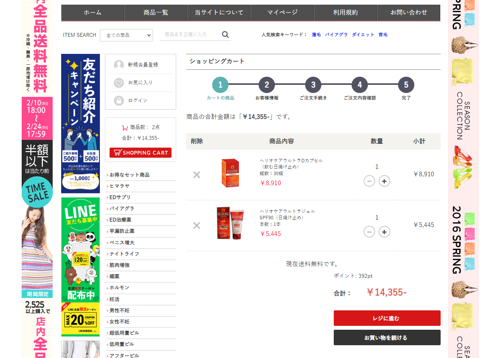
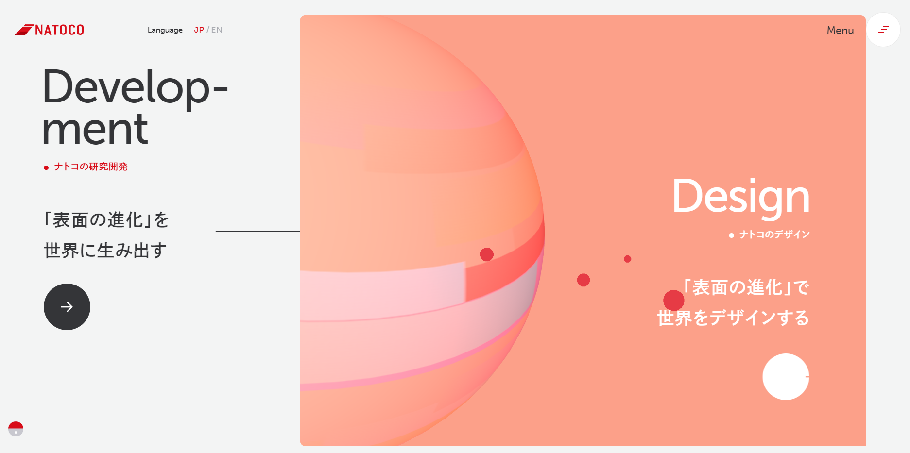

# 宮口稲次郎

Next.jsとtailwindを利用してこのポートフォリオを作成しました。

## Getting Started

サーバーの起動

```bash
        npm run dev   
******yarnをインストールした場合     
        yarn dev
```
## ポートフォリオ
        XServerを利用するECーCUBEサイト
プロジェクト開発に参加し、サーバー構築、決済機能、顧客管理を実現。
 

        Three.js開発
Three.jsで注文を受けた最初の依頼だったが、最高の質を担保できた。

        3Dアニメーションの実現

NginxとThree.jsを利用して簡単な同化効果を追加したスタイリッシュなホームページを作...


        デザインとコーディングの経験
長年デザインコーディングの経験を持っており、5000pxコーディングも一瞬でできる。いつでもデ...
